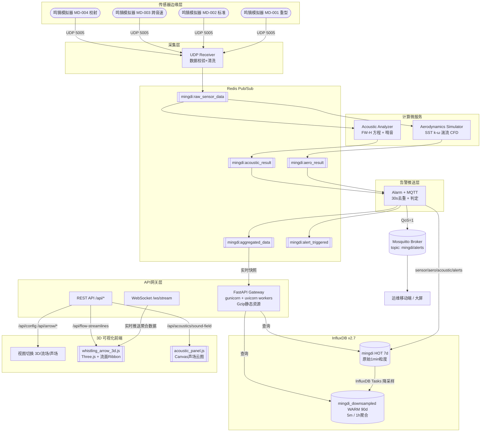

# 鸣镝（响箭）空气动力学仿真与声学分析系统

> 某军事史团队汉代鸣镝复原研究平台：CFD 气动仿真 + SST k-ω 湍流修正 + FW-H 气动声学方程 + 3D 可视化 + 告警推送

---

## 一、系统架构



---

## 二、技术栈

| 层次 | 组件 | 版本/选型 |
|------|------|-----------|
| API 网关 | FastAPI + Gunicorn(2 workers) + UvicornWorker | Python 3.12, FastAPI 0.104 |
| 消息总线 | Redis Pub/Sub | Redis 7.4-alpine, maxmemory 256M + AOF |
| 时序存储 | InfluxDB + 降采样 Tasks | InfluxDB 2.7-alpine |
| 告警推送 | Mosquitto (MQTT 3.1.1 + WebSocket) | Eclipse Mosquitto 2.0 |
| 空气动力学 | SST k-ω 湍流模型 + Prandtl-Glauert 压缩性 + 跨音速波阻 | 自研 |
| 声学分析 | FW-H 方程 (monopole/dipole/quadrupole) + 近场修正 + 腔式共鸣 | 自研 |
| 3D 可视化 | Three.js r128 + OrbitControls + 流面 Ribbon BufferGeometry | 自研 |
| 声场云图 | Canvas 2D 径向色彩映射 | 自研 |
| 部署 | Docker Compose 多阶段构建 + tini 最小 PID 1 | Docker 24+, Compose v2 |

---

## 三、部署步骤

### 3.1 最小部署（本机 Docker Compose）

```bash
# 1. 准备环境变量
cp .env.example .env
# 按需修改端口/Token/告警阈值

# 2. 构建 Python 多阶段镜像 (builder+前端压缩+runtime)
docker compose build app-base

# 3. 拉起基础组件 + 微服务
#    influxdb-init 会自动创建 HOT(7d)/WARM(90d) bucket + 4 条 Flux 降采样任务
docker compose up -d \
  influxdb redis mqtt \
  influx-init \
  api-gateway udp-receiver aero-simulator acoustic-analyzer alarm-mqtt

# 4. （可选）启动模拟器 (4支不同形状的鸣镝)
docker compose up -d sensor-simulator

# 5. 健康检查
docker compose ps
curl -sf http://localhost:8000/api/health
```

访问前端：**http://localhost:8000/static/index.html**

### 3.2 启动顺序与依赖

| 服务 | 必须在之前就绪 |
|------|---------------|
| influx-init | influxdb (healthy) |
| alarm-mqtt | influxdb, redis, mqtt |
| api-gateway | influxdb, redis, mqtt |
| aero-simulator / acoustic-analyzer | redis（即可独立启动）|
| udp-receiver | redis（即可独立启动）|
| sensor-simulator | udp-receiver（started）|

### 3.3 本地开发（非 Docker）

```bash
# 先启 Redis / InfluxDB / Mosquitto
python -m venv .venv
.venv\Scripts\activate        # Windows
# source .venv/bin/activate   # Linux

pip install -r requirements.txt

# 终端1: API Gateway
uvicorn backend.main:app --reload --port 8000

# 终端2-5: 四个微服务
python services/udp_receiver.py
python services/aerodynamics_simulator.py
python services/acoustic_analyzer.py
python services/alarm_mqtt.py

# 终端6: 模拟器
python scripts/sensor_simulator.py --host localhost --port 5005 --list
python scripts/sensor_simulator.py --once   # 每支箭发一次，调试用
```

### 3.4 数据保留分层

| Bucket | 粒度 | 保留期 | 降采样任务 |
|--------|------|--------|-----------|
| `mingdi` (HOT) | 原始 1min | 7 天 | 源数据 |
| `mingdi_downsampled` (WARM) | 5 min 均值, 1 h 告警计数 | 90 天 | `sensor_data_5m_mean`<br/>`aerodynamics_5m_mean`<br/>`acoustics_5m_mean`<br/>`alerts_1h_count` |

---

## 四、鸣镝传感器模拟器用法

### 4.1 命令行参数

```bash
python scripts/sensor_simulator.py --help

  --config PATH     箭矢配置文件路径，默认 config/arrow_profiles.json
  --host HOST       UDP 目标主机 (覆盖配置)
  --port PORT       UDP 目标端口
  --arrow-id ID     只启动某一支箭 (MD-001..MD-004)
  --duration N      运行 N 秒后退出，0 为无限
  --once            每支箭发送一次即退出（端到端调试）
  --list            列出所有箭矢配置并退出
```

### 4.2 4 支预置鸣镝（`--list`）

| ID | 名称 | 形状 | 初速度 | 发射角 | 间隔 |
|----|------|------|--------|--------|------|
| **MD-001** | 铜鸣镝（重型） | heavy (L=0.92m, D=9.5mm) | 55~70 m/s | 0.25~0.45 rad | 60s |
| **MD-002** | 骨鸣镝（标准） | standard (L=0.85m, D=8mm) | 60~80 m/s | 0.20~0.40 rad | 60s |
| **MD-003** | 高速传令箭 | sleek (L=0.78m, D=6.5mm) | 90~130 m/s (**跨音速 sweep**) | 0.15~0.30 rad | 60s |
| **MD-004** | 校射箭 | training (L=0.80m, D=9mm, blunt) | 35~55 m/s | 0.40~0.65 rad | 90s |

### 4.3 自定义箭矢（在 `config/arrow_profiles.json` 中添加）

```jsonc
{
  "arrow_id": "MD-005",
  "name": "玉鸣镝（礼仪）",
  "shape_profile": "ceremonial",
  "shape": {
    "length_m": 0.95,
    "diameter_m": 0.009,
    "mass_kg": 0.027,
    "whistle_diameter_m": 0.022,
    "whistle_length_m": 0.045,
    "fletching_count": 4,
    "tip_type": "jade_blunt"
  },
  "velocity_profile": {
    "mode": "fixed_range",
    "initial": [45.0, 65.0],
    "decay_per_min": 0.90,
    "jitter_std": 1.2
  },
  "rotation_profile": { "initial": [70.0, 110.0], "decay_per_min": 0.94 },
  "launch_angle": [0.30, 0.55],
  "whistle_tuning": { "strouhal_bias": 0.005, "frequency_offset_hz": 200.0 },
  "enabled": true,
  "interval_seconds": 75
}
```

### 4.4 UDP 数据包格式（JSON over UDP）

```json
{
  "arrow_id": "MD-001",
  "arrow_name": "铜鸣镝（重型）",
  "shape_profile": "heavy",
  "timestamp": "2026-06-17T10:01:12.003000+00:00",
  "velocity": 63.2,
  "rotation_speed": 112.7,
  "whistle_frequency": 2087.4,
  "sound_pressure_level": 82.1,
  "altitude": 47.3,
  "pitch": 0.294,
  "yaw": 0.013,
  "shape": { "length_m": 0.92, "diameter_m": 0.0095, "...": "..." }
}
```

---

## 五、REST API

| Method | Path | 参数 | 说明 |
|--------|------|------|------|
| GET | `/api/health` | — | 网关+Redis+Influx 连通性健康检查 |
| GET | `/api/config` | — | 箭体/空气/告警阈值配置 |
| POST | `/api/sensor/data` | SensorData JSON | **HTTP 旁路**上报传感器数据（转发至 Redis RAW）|
| GET | `/api/sensor/data` | arrow_id?, start=-1h, limit=100 | 从 InfluxDB 查询历史传感器数据 |
| GET | `/api/arrow/{id}/status` | — | 某支箭最新状态 + 射程估算 + 告警标记 |
| GET | `/api/aerodynamics/simulate` | velocity, angle_of_attack, rotation_speed | 实时 CFD 仿真 |
| GET | `/api/aerodynamics/trajectory` | initial_velocity, launch_angle, initial_rotation | 2D 弹道轨迹点序列 |
| GET | `/api/acoustics/simulate` | velocity, rotation_speed, distance | 实时 FW-H 声学分析 |
| GET | `/api/acoustics/sound-field` | velocity, rotation_speed, grid_size=30 | 声场云图栅格数据 |
| GET | `/api/alerts` | arrow_id?, start=-24h, limit=50 | 历史告警查询 |
| GET | `/api/flow-streamlines` | velocity, grid_size=20 | 流面路径坐标（前端回退）|
| WS | `/ws/stream` | — | 聚合数据 WebSocket 推送：每有新箭数据即广播 |

**关键响应示例**：`GET /api/aerodynamics/simulate?velocity=65&angle_of_attack=0.3&rotation_speed=100`
```json
{
  "velocity": 65.0,
  "angle_of_attack": 0.3,
  "reynolds_number": 30207.0,
  "mach_number": 0.190,
  "drag_coefficient": 1.15,
  "lift_coefficient": 0.535,
  "drag_force": 0.153,
  "lift_force": 0.071,
  "moment": 0.023,
  "turbulent_kinetic_energy": 12.7,
  "specific_dissipation_rate": 5830.0,
  "eddy_viscosity_ratio": 4.2
}
```

---

## 六、关键工程化细节

### 6.1 FastAPI Gunicorn 部署
- **Workers**: 2 (CPU核数 * 2 + 1 的简化)
- **Worker Class**: `uvicorn.workers.UvicornWorker`（ASGI，支持 WebSocket）
- **tini** 作 PID 1，确保 worker 正确收信号不僵尸
- **`/static` Gzip 双保险**：
  1. `PreCompressedStaticMiddleware` 先检查 `.gz` 预压缩文件（Docker 构建阶段 alpine gzip -9）
  2. 命中不到走 `GZipMiddleware`（阈值 500B 实时压缩）

### 6.2 InfluxDB 降采样
Docker Compose `influx-init` 一次性任务：建好 bucket 后注册 4 条 Flux Task：
```flux
option task = {name: "sensor_data_5m_mean", every: 5m}
data = from(bucket: "mingdi")
  |> range(start: -task.every)
  |> filter(fn: (r) => r._measurement == "sensor_data")
  |> filter(fn: (r) => contains(value: r._field, set: ["velocity", ...]))
  |> aggregateWindow(every: 5m, fn: mean, createEmpty: false)
  |> to(bucket: "mingdi_downsampled", org: "mingdi-lab")
```

### 6.3 Redis Pub/Sub 通道协议
所有消息为 `{"timestamp/at字段": ISO, "arrow_id": str, "...payload..."}` JSON：
- RAW → AERO 并行 & ACOUSTIC 并行（计算水平扩展点）
- AERO + ACOUSTIC 在 alarm_mqtt 中以 `received_at` 为 join key，两个都到达才 AGGREGATE
- 告警 30s 去重窗口，key = `arrow_id + alert_type`

---

## 七、目录结构

```
mingdi-system/
├── backend/
│   ├── main.py                   # FastAPI 网关 (Gzip + gunicorn)
│   ├── config.py                 # pydantic-settings 环境变量
│   ├── config_loader.py          # 读取 JSON 配置 (气动/声学/箭矢)
│   ├── message_bus.py            # Redis Pub/Sub 封装 + 5 通道定义
│   ├── models.py                 # Pydantic 模型
│   ├── influx_client.py          # InfluxDB 读写封装
│   ├── udp_listener.py           # 原始 UDP 监听（旧：单体模式保留）
│   ├── mqtt_publisher.py         # MQTT 告警发布封装
│   ├── alerts.py                 # 告警评估函数（alarm_mqtt 调用）
│   ├── store.py                  # 单体模式旧 pipeline
│   └── physics/
│       ├── aerodynamics.py       # SST k-ω CFD + 轨迹
│       └── aeroacoustics.py      # FW-H 声学 + 哨音
├── services/
│   ├── udp_receiver.py           # 微服务1：UDP + 校验 → RAW
│   ├── aerodynamics_simulator.py # 微服务2：RAW → SST CFD → AERO
│   ├── acoustic_analyzer.py      # 微服务3：RAW → FW-H → ACOUSTIC
│   └── alarm_mqtt.py             # 微服务4：AERO+ACOUSTIC → ALERT+MQTT+AGG
├── scripts/
│   ├── sensor_simulator.py       # 多箭矢 UDP 模拟器 v2
│   └── influxdb_init.py          # bucket + 保留策略 + 降采样任务
├── frontend/
│   ├── index.html                # 三栏布局主页面
│   ├── css/style.css
│   └── js/
│       ├── app.js                # 主入口（状态管理 + 数据）
│       ├── whistling_arrow_3d.js # Three.js 场景 + 流面 Ribbon
│       └── acoustic_panel.js     # Canvas 声场云图 + 告警面板
├── config/
│   ├── aerodynamics.json         # 气动参数 (SST k-ω / 阻力 / 弹道)
│   ├── acoustics.json            # 声学参数 (FW-H / 哨音 / 环境)
│   └── arrow_profiles.json       # 4 支鸣镝形状 + 速度 + 频率偏置
├── deploy/
│   └── mosquitto.conf            # MQTT Broker 配置（匿名 + 1883/9001）
├── Dockerfile                    # 三阶段：builder → frontend.gz → runtime
├── docker-compose.yml            # 9 服务编排
├── .env.example
├── .dockerignore
└── requirements.txt
```

---

## 八、停止 / 清理

```bash
# 停止所有服务
docker compose down

# 完全重置（删除持久化卷！）
docker compose down -v
docker rmi mingdi-app:latest
```
